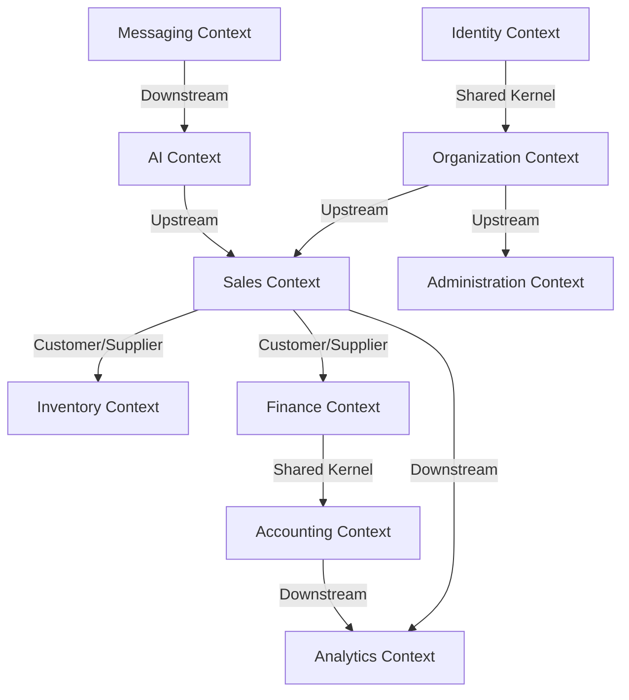

# Fables Flow --- Bounded Contexts Design

To ensure a clean, maintainable, and modular monorepos architecture that can scale and transition seamlessly to microservices when required, the system domain is strictly divided into the following Bounded Contexts.

---

## Bounded Context Mapping

---

## 1. Identity Context

- **Boundary**: Handles user authentication, credential storage, JWT issuance, refresh token rotation, session invalidation, and role assignment.
- **Ubiquitous Language**: `User`, `Password Hash`, `Access Token`, `Refresh Token`, `Credential Store`, `Session Blacklist`.
- **Primary Entities & Value Objects**: `User` (Entity), `Role` (Value Object), `Credentials` (Value Object).
- **Core Business Rules**:
  - Passwords hashed using Argon2.
  - JWT tokens stored in secure, HTTP-only, SameSite cookies.
  - Refresh tokens rotation enforced; replay attempts immediately blacklist the token family.

## 2. Organization Context

- **Boundary**: Defines boundaries of tenancy, subscription status, licensing limits, seat allowances, and workspace properties.
- **Ubiquitous Language**: `Organization`, `Tenant`, `Plan Tier`, `Subscription Limit`, `Feature Flag`, `Invitation`.
- **Primary Entities & Value Objects**: `Organization` (Entity), `Invitation` (Entity), `TenantId` (Value Object).
- **Core Business Rules**:
  - Absolute data isolation enforced at request boundary. Interceptors inject `organization_id` into all operations.
  - Organization configurations govern global settings (e.g., auto-invoice generation, interest rates).

## 3. Sales Context

- **Boundary**: Manages the life cycle of orders, sales territories, customers (retailers), and field representative allocations.
- **Ubiquitous Language**: `Retailer`, `Order`, `OrderItem`, `Sales Territory`, `Credit Limit`, `Price List`, `Order Status`.
- **Primary Entities & Value Objects**: `Retailer` (Entity), `Order` (Entity), `OrderItem` (Value Object), `Territory` (Entity).
- **Core Business Rules**:
  - Placing an order requires verification of the retailer's credit status against outstanding ledger limits.
  - Order approval triggers an internal domain event `OrderApproved` for the Inventory context.

## 4. Inventory Context

- **Boundary**: Manages stock levels, batch numbering, goods procurement, warehouses, bin locations, and physical picking/packing processes.
- **Ubiquitous Language**: `Warehouse`, `Warehouse Zone`, `Rack`, `Bin Location`, `Stock Batch`, `Stock Ledger`, `Reservation`, `Purchase Order`, `Goods Received Note (GRN)`, `Stock Adjustment`.
- **Primary Entities & Value Objects**: `Warehouse` (Entity), `StockBatch` (Entity), `StockLedgerEntry` (Entity), `BinLocation` (Value Object).
- **Core Business Rules**:
  - Stock reservations are created when an order is approved.
  - Physical inventory deductions happen at dispatch time, clearing the reservation.
  - Batch tracking requires validation of expiry dates; expired batches are locked from sales reservations.

## 5. Finance Context

- **Boundary**: Responsible for collections management, invoicing operations, credit notes, debit notes, payment allocations, and outstanding tracking.
- **Ubiquitous Language**: `Invoice`, `Payment`, `Payment Allocation`, `Credit Note`, `Debit Note`, `Outstanding Balance`, `Collection Task`.
- **Primary Entities & Value Objects**: `Invoice` (Entity), `Payment` (Entity), `Allocation` (Value Object), `CollectionTask` (Entity).
- **Core Business Rules**:
  - Invoices cannot be mutated once marked `Sent`. Any corrections must be performed via Credit or Debit Notes.
  - Payment allocations decrease the target invoice outstanding amount, raising events when the invoice is fully settled.

## 6. Accounting Context

- **Boundary**: Holds the general ledger, charts of accounts, journal entries, tax calculations, and cash books. Ensures compliance with double-entry principles.
- **Ubiquitous Language**: `General Ledger`, `Ledger Account`, `Journal Entry`, `Ledger Entry`, `Chart of Accounts`, `Debit`, `Credit`.
- **Primary Entities & Value Objects**: `LedgerAccount` (Entity), `JournalEntry` (Entity), `LedgerEntry` (Value Object).
- **Core Business Rules**:
  - Every financial transaction must write a balanced debit and credit ledger entry: $\sum \text{Debits} = \sum \text{Credits}$.
  - Historic entries are immutable. Edits prompt correction entries.

## 7. AI Context

- **Boundary**: Operates parsing structures, language normalizations, vector indexing, and confidence scoring.
- **Ubiquitous Language**: `Normalizer`, `Language Tag`, `Product Vector Match`, `Extraction Schema`, `Confidence Score`, `Review Queue`.
- **Primary Entities & Value Objects**: `AiExtraction` (Entity), `TokenCost` (Value Object).
- **Core Business Rules**:
  - Parsing confidence is calculated based on matches. If $< 90\%$, it requires human verification.
  - Tracks exact token usage details to measure tenant consumption cost.

## 8. Messaging Context

- **Boundary**: Interacts with the WhatsApp Business Platform, handling webhook ingress, message matching, direction tracking, and templates.
- **Ubiquitous Language**: `WhatsappMessage`, `Webhook Signature`, `Message ID`, `Message Direction`.
- **Primary Entities & Value Objects**: `WhatsappMessage` (Entity), `RecipientPhone` (Value Object).
- **Core Business Rules**:
  - Verifies signature of all incoming webhooks using the HMAC-SHA256 secret.
  - Message ID deduplication prevents processing duplicate WhatsApp hooks.

## 9. Analytics Context

- **Boundary**: Processes reports, aging analysis, predictive risks, and performance KPIs.
- **Ubiquitous Language**: `Retailer Health Score`, `Collection Risk`, `DSO (Days Sales Outstanding)`, `Demand Forecast`.
- **Primary Entities & Value Objects**: `MetricSnapshot` (Value Object), `AgingBucket` (Value Object).
- **Core Business Rules**:
  - Metrics calculated daily via background jobs to prevent database locks on live transaction tables.

## 10. Administration Context

- **Boundary**: Handles tenant seats, custom system settings, system feature flags, audit histories, and overall platform administration.
- **Ubiquitous Language**: `Audit Log`, `Feature Flag Toggle`, `System Parameters`.
- **Primary Entities & Value Objects**: `AuditLog` (Entity), `FeatureFlag` (Value Object).
- **Core Business Rules**:
  - Audit logs are immutable and stored in a read-heavy query-optimized storage format.
