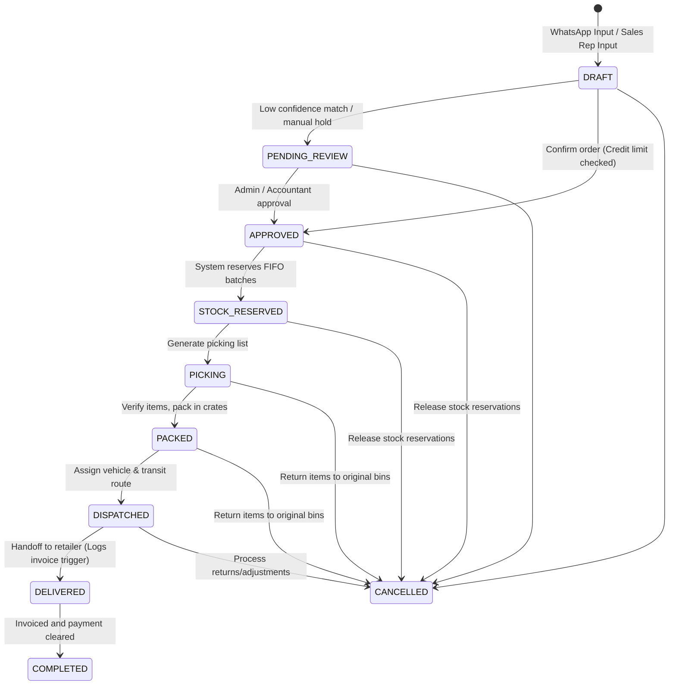
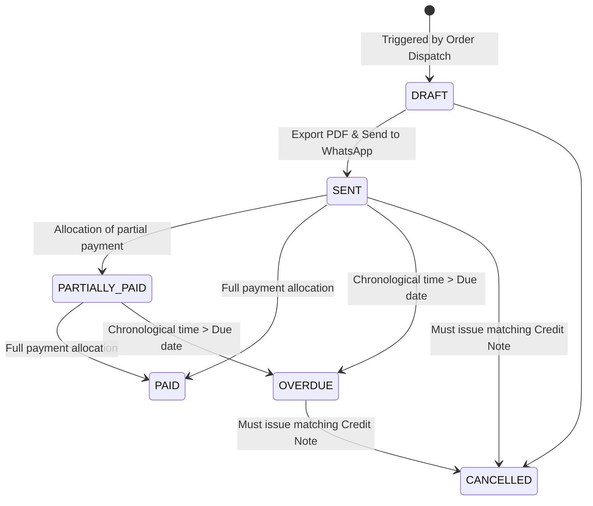
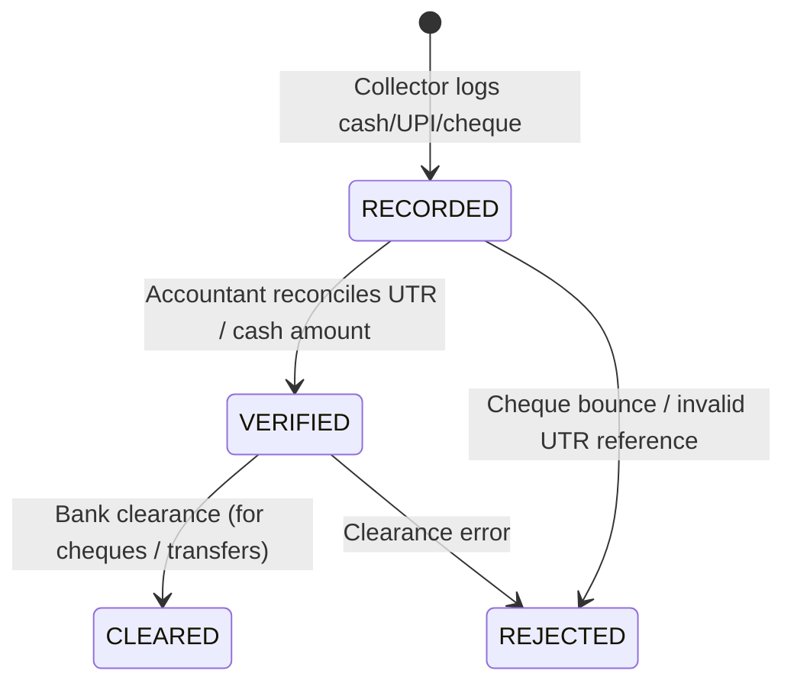
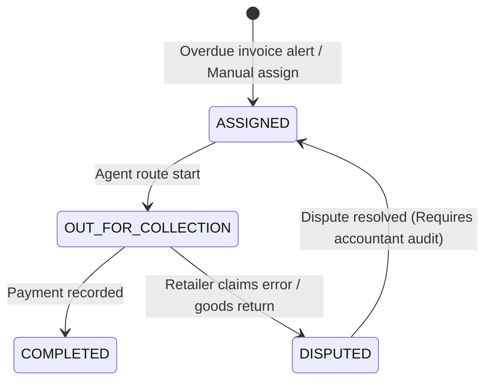
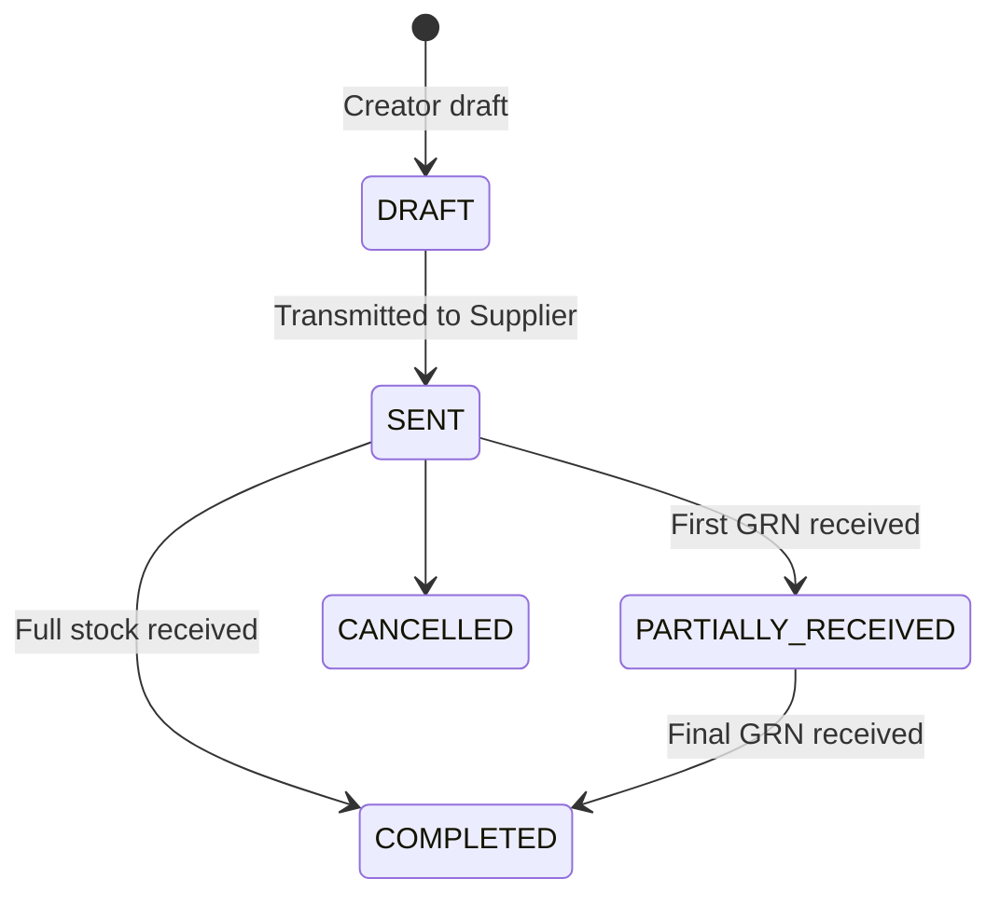
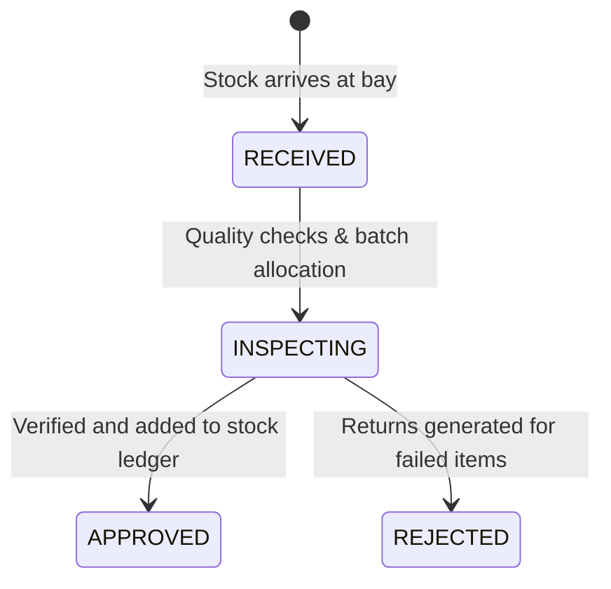
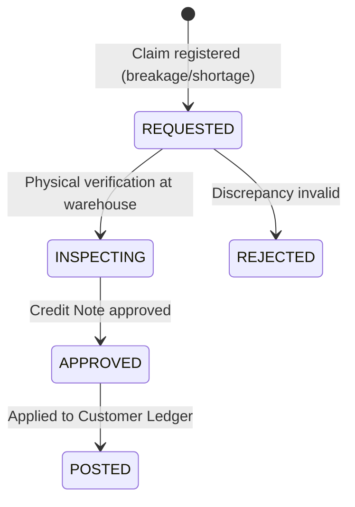

# Fables Flow --- Domain Workflows & State Machines

This document defines the strict states, valid transitions, and invariants for all major operational entities in Fables Flow.

---

## 1. Order State Machine

### Invariants & Rules

- **Approved**: Triggers credit limit checks. If outstanding + order value > limit, state defaults to `PENDING_REVIEW` with tag `CREDIT_BLOCK`.
- **Stock Reserved**: Inserts reservation entries in the `StockLedger`.
- **Cancelled**: Releasing reservations is mandatory. If cancelled after packing, items must be re-added to inventory bins using a `TRANSFER_IN` ledger type.

---

## 2. Invoice State Machine

### Invariants & Rules

- **Draft**: GST (CGST, SGST, IGST) values are calculated.
- **Sent**: The record becomes **immutable**. Direct database edits are blocked; adjustments require a credit/debit note.
- **Paid**: Triggers check on corresponding Order state to transition it to `Completed` if all linked invoices are paid.

---

## 3. Payment State Machine

### Invariants & Rules

- **Recorded**: Unallocated amount is set to total amount.
- **Verified**: Generates ledger journal entries in the double-entry accounting system.
- **Rejected**: Removes payment allocation rows and recalculates linked invoice balances. Emits alert event `PaymentReboundAlert`.

---

## 4. Collection Task State Machine

### Invariants & Rules

- **Assigned**: Task assigned to a Collector role for a specific territory.
- **Completed**: Triggers payment recording event.

---

## 5. Purchase Order (PO) State Machine

---

## 6. Goods Received Note (GRN) State Machine

### Invariants & Rules

- **Approved**: Triggers creation of `StockBatch` and registers addition entries in the `StockLedger`. Writes Journal Entry (Debit Inventory Asset, Credit AP Accrual).

---

## 7. Return & Credit Note State Machine

### Invariants & Rules

- **Posted**: Triggers Journal Entry (Debit Sales Returns, Debit GST Payable, Credit Accounts Receivable) and automatically updates the corresponding Retailer Ledger balance.
